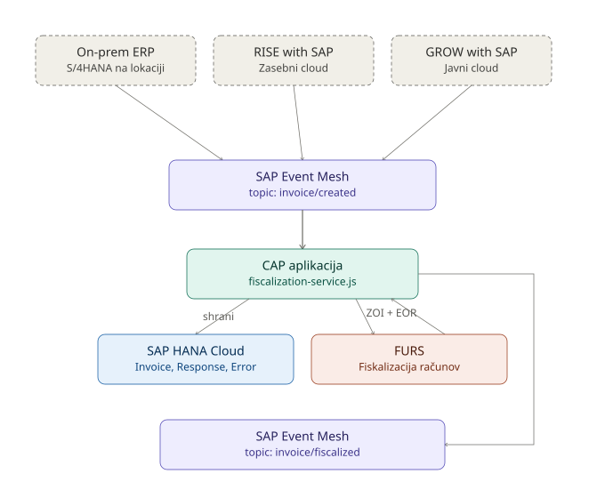

# Itelis – Davčne blagajne

CAP aplikacija za obdelavo računov in njihovo fiskalizacijo pri **FURS**. Aplikacija za asinhrono izmenjavo sporočil uporablja **SAP Event Mesh**, za trajno shranjevanje računov, fiskalizacijskih rezultatov in napak pa **SAP HANA Cloud**.

Projekt je implementiran kot **SAP Cloud Application Programming Model (CAP)** aplikacija v Node.js.

---

## Arhitektura



Sivi, prekinjeno obrobljeni bloki na vrhu predstavljajo možne prihodnje vire dogodka — trenutno se testni računi objavljajo ročno preko Event Mesh cockpita, v produkciji pa bi lahko isti dogodek sprožil kateri koli ERP vir (on-premise, RISE with SAP ali GROW with SAP), ne da bi bilo treba spreminjati logiko CAP aplikacije.

### Potek obdelave

1. Izvorni sistem (ali testno orodje) objavi račun na topic `invoice/created` v **SAP Event Mesh**.
2. CAP aplikacija (`subscriber.js`) prejme sporočilo iz ustreznega queue-a.
3. `fiscalization-service.js` podatke obdela in pokliče **FURS** za fiskalizacijo.
4. FURS vrne status, **ZOI**, **EOR** in dodatne podatke o obdelavi.
5. Rezultat se skupaj z izvornim računom trajno shrani v **SAP HANA Cloud**.
6. Šele nato se rezultat fiskalizacije objavi nazaj na **SAP Event Mesh** (topic `invoice/fiscalized`).
7. Odjemalec prebere rezultat iz rezultatnega queue-a, ga preveri v Event Mesh cockpitu ali neposredno v HANA Database Exploreru.

---

## Struktura projekta

```text
Itelis-davcne-blagajne/
│
├── db/
│   └── fiscal.cds
│
├── srv/
│   ├── fiscalization-service.js
│   ├── messaging.js
│   ├── register-premise-test.js
│   ├── results-listener.js
│   ├── server.js
│   ├── subscriber.js
│   │
│   └── furs/
│       ├── certificate.js
│       ├── furs-client.js
│       ├── jws.js
│       ├── test-certificate.js
│       ├── test-furs.js
│       ├── test-jws.js
│       ├── test-zoi.js
│       └── zoi.js
│
├── certificates/
│   ├── 10698655-1.p12
│   ├── 69064792-2.p12
│   ├── blagajne-test.fu.gov.si.cer
│   ├── furs-ca-chain.pem
│   ├── sigov-ca2.pem
│   ├── sigov-ca2.xcert.crt
│   ├── si-trust-root.crt
│   └── si-trust-root.pem
│
├── env/
│   └── .env1
│
├── .cdsrc-private.json
├── .env
├── .gitignore
├── default-env.json
├── em-params.json
├── manifest.yml
├── package.json
├── package-lock.json
├── README.md
└── xs-security.json
```

> `node_modules`, `.git`, `gen` in druge generirane mape niso vključene v prikaz strukture.

---

## Glavne komponente

### `db/fiscal.cds`

Glavni CDS podatkovni model aplikacije. Definira entitete za račune (`Invoice`), fiskalizacijske odgovore (`Response`) in napake (`ErrorLog`). Ob deployu se iz modela generirajo ustrezni HANA artefakti.

### `srv/server.js`

Vstopna točka CAP strežnika — zažene aplikacijo in naloži definirane servise ter poslušalce sporočil.

### `srv/subscriber.js`

Obravnava vhodna sporočila iz SAP Event Mesh: sprejme dogodek o ustvarjenem računu in sproži nadaljnjo obdelavo.

### `srv/messaging.js`

Pomožna konfiguracija za komunikacijo s SAP Event Mesh preko CAP messaging vezave na Enterprise Messaging servis.

### `srv/fiscalization-service.js`

Osrednja poslovna logika: poveže prejeti račun s postopkom fiskalizacije pri FURS, shrani rezultat v bazo in ga objavi nazaj na Event Mesh.

### `srv/results-listener.js`

Poslušalec rezultatnega toka sporočil fiskalizacije, uporaben za dodatno spremljanje ali posredovanje rezultatov.

### `srv/register-premise-test.js`

Testna logika za registracijo oz. preverjanje poslovnega prostora v testnem okolju.

---

## FURS integracija

Mapa `srv/furs/` vsebuje celotno logiko za komunikacijo s sistemom FURS:

| Datoteka | Namen |
|---|---|
| `furs-client.js` | Implementacija HTTPS komunikacije s FURS |
| `certificate.js` | Delo s certifikati, potrebnimi za avtentikacijo |
| `jws.js` | Podpisovanje in dekodiranje JWS sporočil |
| `zoi.js` | Izračun ZOI (zaščitne oznake izdajatelja) |
| `test-*.js` | Testne datoteke za preverjanje posameznih delov integracije |

---

## SAP Event Mesh

Vhodni tok uporablja topic:

```text
itelis/fiscal/test/invoice/created
```

Primer testnega sporočila:

```json
{
  "invoiceId": "25",
  "taxNumber": "10698655",
  "amount": 250.75,
  "timestamp": "2026-09-07T12:00:00",
  "premiseId": "POS1",
  "deviceId": "DEV1"
}
```

Po uspešni fiskalizaciji se rezultat objavi na rezultatni topic (`invoice/fiscalized`):

```json
{
  "data": {
    "invoiceId": "25",
    "status": "CONFIRMED",
    "zoi": "6557229d3af1a54ddbe79074e8478ec6",
    "eor": "99996046-8c65-41dc-9403-f6c3def4384d",
    "premiseid": "POS1",
    "deviceid": "DEV1",
    "amount": 250.75,
    "timestamp": "2026-09-08T10:23:23.934Z"
  }
}
```

> Rezultat ni samo sporočilo za Event Mesh — podatki o fiskalizaciji se hkrati trajno shranijo v SAP HANA Cloud.

---

## SAP HANA Cloud

Podatkovna baza teče na **SAP HANA Cloud** preko **HDI containerja**. Uporabljeni servisni instanci:

```text
davcne-blagajne-hdi    # HDI container, preko katerega je aplikacija povezana na HANA
davcne-blagajne-test   # osnovna HANA Cloud instanca
```

CDS konfiguracija:

```json
"db": {
  "kind": "hana",
  "model": ["srv", "db"]
}
```

Uporabljen paket: `@cap-js/hana`.

Iz `db/fiscal.cds` se generirajo naslednje HANA tabele in pripadajoči pogledi za CAP servis:

| Tabela | Vsebina |
|---|---|
| `FISC_INVOICE` | Podatki vhodnih računov |
| `FISC_RESPONSE` | Rezultati fiskalizacije, vključno z ZOI in EOR |
| `FISC_ERRORLOG` | Beleženje napak pri obdelavi |

---

## Razvojno okolje

### Vezava na HDI container

Za lokalni razvoj (BAS ali drugo okolje) se uporablja `cds bind`:

```bash
cds bind -2 davcne-blagajne-hdi --kind hana
```

Aktivno konfiguracijo preverimo z:

```bash
cds env get requires.db --profile hybrid
```

Pri pravilni vezavi mora biti viden `kind: hana` in binding na `davcne-blagajne-hdi`.

### Deploy podatkovnega modela

```bash
cds deploy --to hana --profile hybrid
```

Uspešen deploy ustvari oz. posodobi HANA artefakte iz `db/fiscal.cds` (`fisc.Invoice`, `fisc.Response`, `fisc.ErrorLog` in ustrezne CDS view-e).

### Vezava na SAP Event Mesh

```bash
cds bind -2 event_mesh --for messaging --kind enterprise-messaging-amqp
cds bind -2 event_mesh --for fiscalization-results --kind enterprise-messaging-amqp
```

### Zagon v hybrid načinu ter vseh dodatnih profilih

```bash
cds bind --exec -- cds watch --profile hybrid,messaging,fiscalization-results
```

S tem aplikacija uporablja Cloud Foundry service bindings namesto ročno vnesenih credentials. Ob uspešnem zagonu se izpiše povezava `db > hana` s podatki o uporabljenem HDI containerju; za Event Mesh mora biti poleg baze pravilno vzpostavljena tudi messaging vezava.

---

## Konfiguracijske datoteke

| Datoteka | Namen |
|---|---|
| `.env` | Lokalne okoljske spremenljivke |
| `default-env.json` | Lokalna simulacija Cloud Foundry okolja |
| `.cdsrc-private.json` | Lokalne CDS service bindings, ki jih ustvari `cds bind` — **vsebuje dostopne podatke, ne objavljaj je** |
| `em-params.json` | Parametri za uporabo SAP Event Mesh |
| `env/.env1` | Dodatna okoljska konfiguracija |

---

## Certifikati

Mapa `certificates/` vsebuje certifikate za komunikacijo s testnim okoljem FURS: FURS certifikate, CA chain, SIGOV certifikate, root certifikate in `.p12` datoteke.

> **Opozorilo:** v produkcijskem Git repozitoriju se zasebnih ključev in produkcijskih certifikatov ne sme objavljati. Certifikate, namenjene zgolj lokalnemu testiranju, upravljaj ločeno in jih dodaj v `.gitignore`.

---

## Cloud Foundry

Aplikacija teče v SAP BTP Cloud Foundry okolju. Trenutno testno okolje:

```text
API:    https://api.cf.eu10-004.hana.ondemand.com
Space:  BTP_test
```

Pred deployem preverimo cilj in stanje servisov:

```bash
cf target
cf services | grep davcne-blagajne
```

Pri pravilni konfiguraciji morata biti obe servisni instanci v stanju `create succeeded`.

---

## Testni scenarij

**1. Pošlji testni račun v Event Mesh** — objavi sporočilo na `itelis/fiscal/test/invoice/created` (glej primer zgoraj).

**2. CAP aplikacija obdela račun** — subscriber prejme sporočilo, sproži fiskalizacijo, podatki se shranijo v HANA Cloud, nato se izvede komunikacija s FURS.

**3. Preberi rezultat** — po uspešni fiskalizaciji se rezultat objavi na rezultatni Event Mesh queue in ga lahko preveriš na tri načine:

- v **SAP Event Mesh** cockpitu (Test → Consume Messages),
- v **SAP HANA Database Explorer**,
- v logih CAP aplikacije.

### Preverjanje podatkov v HANA Database Explorer

```sql
SELECT * FROM "FISC_INVOICE" ORDER BY "CREATEDAT" DESC;
SELECT * FROM "FISC_RESPONSE" ORDER BY "CREATEDAT" DESC;
```

Pri uspešni fiskalizaciji mora biti v podatkih viden rezultat, vključno z ZOI in EOR.

---

## Tehnologije

SAP CAP · Node.js · SAP HANA Cloud · SAP HDI Container · SAP Event Mesh · SAP BTP Cloud Foundry · FURS fiskalizacijski sistem · JWS · X.509 certifikati · Cloud Foundry service bindings

---

## Status projekta

Trenutna implementacija omogoča:

- [x] sprejem računov preko SAP Event Mesh
- [x] obdelavo računov v CAP aplikaciji
- [x] povezavo s SAP HANA Cloud in trajno shranjevanje računov
- [x] fiskalizacijo pri FURS
- [x] shranjevanje rezultata fiskalizacije (ZOI, EOR)
- [x] objavo rezultata nazaj v SAP Event Mesh
- [x] preverjanje rezultatov preko Event Mesh in HANA Database Explorer

Podrobna navodila za namestitev, konfiguracijo servisov in izvedbo celotnega testnega scenarija je mogoče dodati v naslednjih poglavjih.
